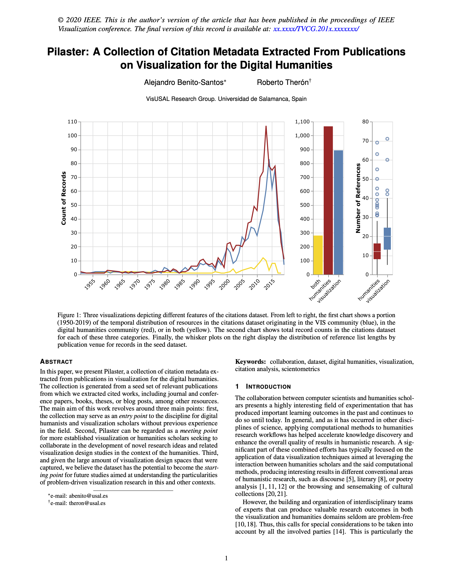
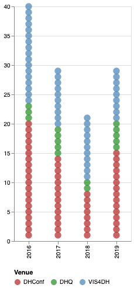
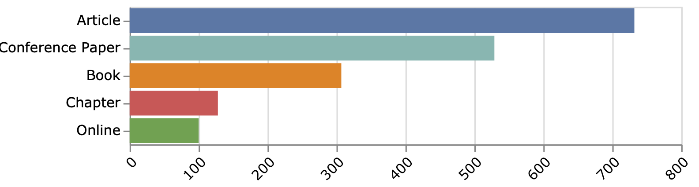
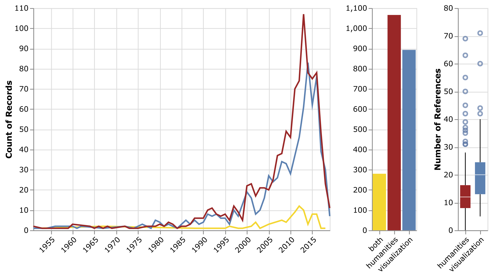

**Pilaster** is a collection of citation metadata extracted from publications on visualization for the digital humanities. 
The collection is generated from a seed set of relevant publications from which we extracted cited works.

The research's main purpose was to provide a contextualized characterization of the field according to its different areas of application and involved disciplines, which could serve as a starting point for future studies such as literature reviews or mapping studies, among others. The study was carried out by researchers from the Visualization and Visual Analytics Group of the University of Salamanca ([VisUSAL](http://visusal.usal.es/)), in Spain.

The dataset is provided as a Google Sheets spreadsheet for ease of manipulation. In addition, we offer some example python code (in Google Colab) to help you get started using the data:

[Get the dataset in Google Sheets](https://docs.google.com/spreadsheets/d/1Z8aMhxpai510hkuSVAFW6L4QyQfPPvUnv8IjKuF2_Jo)

[Get example code in Google Colab](https://colab.research.google.com/drive/15cNprIDXsN1WMa660lo-ApimMib8vdth)

To read the paper, click on the image below:

  

## Seed Dataset
The seed dataset contains 119 publications originated between the years 2016-2019 and it was built by sampling relevant publications on visualization for the digital humanities in three different engineering- ([IEEVIS VIS4DH Workshop](http://vis4dh.dbvis.de/)) and humanities-oriented ([ADHO Digital Humanities Conference](https://adho.org/conference) & [Digital Humanities Quarterly](http://www.digitalhumanities.org/dhq/)) venues.

## Citations Metadata
We extracted and normalized 1934 references from the seed dataset using [Neural-ParsCit](https://github.com/WING-NUS/Neural-ParsCit), which included , including journal and conference papers, books, theses, or blog posts, among other resources.

For each cited work, we collected publication year and venue, keywords, authors and a link to the citing publication in the seed dataset. 

### Cite this work

*A. Benito-Santos and R. Therón, ‘Pilaster: A Collection of Citation Metadata Extracted From Publications on Visualization for the Digital Humanities’, presented at the 5th Workshop on Visualization for the Digital Humanities, 2020.* [BibTeX](bibtex/pilaster.bib)

### Works using this dataset
*A. Benito-Santos and R. T. Sánchez, ‘A Data-Driven Introduction to Authors, Readings, and Techniques in Visualization for the Digital Humanities’, IEEE Computer Graphics and Applications, vol. 40, no. 3, pp. 45–57, May 2020, doi: [10.1109/MCG.2020.2973945](https://doi.org/10.1109/MCG.2020.2973945).* [BibTeX](bibtex/data-driven-introduction.bib)
### Contact
If you want your work displayed in this page, or have any requests for corrections or comments, please contact [Alejandro Benito-Santos.](mailto:abenito@usal.es?subject=[GitHub]Pilaster-contact)

